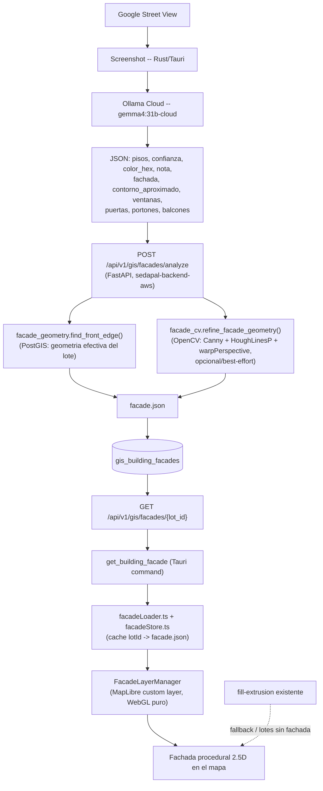

# Fachada procedural 2.5D

Segundo sistema de representación de predios, que **coexiste** con el
`fill-extrusion` general (documentado como comportamiento "hoy" en el hilo de
análisis previo a este cambio). No lo reemplaza: sigue siendo el fallback y
la representación de todos los lotes sin fachada detallada.

## Qué es y qué NO es

- Es una geometría procedural **frontal**: pared + huecos (ventanas, puertas,
  portones, balcones) con pequeños offsets en Z, orientada sobre la arista
  real del lote catastral que da a la calle (`front_edge`).
- **No** es un modelo 3D completo del predio (no hay parte trasera).
- **No** es la foto de Street View pegada como textura/poster.
- **No** depende de ningún modelo de visión/detección local (YOLO, SAM,
  Detectron, etc.). La única IA que interpreta la imagen es Ollama Cloud
  (`gemma4:31b-cloud`, ya usada por el sistema de pisos/color existente).
  OpenCV se usa solo para geometría clásica (Canny/Hough/perspectiva), nunca
  para reconocer objetos.

## Arquitectura



## Fase 1 -- `front_edge` (arista frontal real)

`app/sedapalgis/facade_geometry.py::find_front_edge` (sedapal-backend-aws).
Puro, determinista, sin IA: dado el anillo exterior del lote (PostGIS) y la
posición/heading de Street View, proyecta a un plano local en metros
(equirectangular, sin `pyproj` -- a escala de un lote el error es
despreciable) y puntúa cada arista por:

1. Bearing de la normal saliente de la arista vs. hacia dónde mira la cámara.
2/3. Bearing camara->arista vs. heading.
4. Distancia cámara-arista (desempate).
5. Que la normal saliente apunte hacia la cámara (no hacia el interior del
   lote).

Si hay aristas contiguas con bearing similar (±30°) a la mejor, se funden en
una polilínea (zaguán/retranqueo). Sin `heading` no hay resultado: el
llamador debe caer al fallback, nunca adivinar. Tests:
`tests/test_facade_geometry.py`.

## Fase 2 -- Prompt de Gemma ampliado

`src-tauri/src/streetview.rs`. El prompt sigue pidiendo, en el mismo JSON,
los 4 campos de siempre (`pisos`, `confianza`, `color_hex`, `nota` --
compatibilidad con `gis_lots.estimated_levels`/`color_hex`, que no cambia) y
agrega `fachada` (forma/material/techo/parapeto/retranqueos),
`contorno_aproximado` (4-8 puntos normalizados) y `ventanas`/`puertas`/
`portones`/`balcones` (bboxes normalizados). Instrucción explícita de no
inventar: "usa null, false o listas vacías antes que adivinar". `raw: Value`
en `FloorAnalysisResult` lleva el JSON completo sin tipar campo por campo
(FastAPI valida la forma final).

## Fase 3-4 -- Computer Vision (sin modelos de detección)

`app/sedapalgis/facade_cv.py`. Nunca detecta objetos -- Gemma ya lo hizo.
Solo:

- `detect_dominant_lines`: Canny + HoughLinesP sobre la imagen (o su versión
  rectificada).
- `rectify_perspective`: `getPerspectiveTransform`/`warpPerspective` usando
  las 4 esquinas extremas del contorno de Gemma.
- `snap_outline_to_lines`: mueve cada vértice del contorno al punto más
  cercano de una línea dominante, si está a menos de ~4.5% del ancho/alto de
  la imagen.
- `validate_facade_geometry`: contorno válido (Shapely), sin auto-
  intersección, área no despreciable.

Todo es best-effort: sin `cv2` instalado, sin imagen, o si cualquier paso
falla, se devuelve la estimación de Gemma tal cual (`cv_used=False`),
nunca se lanza una excepción hacia arriba. Ventanas/puertas/portones/
balcones en V1 solo se validan/clampan (no se re-detectan geométricamente
contra la imagen) -- extensión natural para V2 si hace falta más precisión.
Tests: `tests/test_facade_cv.py`.

## Fase 6 -- `facade.json`

Construido por `facade_service._to_facade_json` / `get_facade`:

```json
{
  "version": 1,
  "lotId": "5c9c...",
  "source": { "type": "streetview", "lat": -12.05, "lng": -77.03, "heading": 92.4, "pitch": 85 },
  "gis": { "frontEdge": [[-77.0301, -12.0502], [-77.0299, -12.0502]], "frontWidthM": 8.42, "frontBearing": 92.1 },
  "dimensions": { "levels": 3, "heightM": 8.4, "widthM": 8.42, "depthM": 0.5 },
  "outline": [[0, 1], [0, 0], [1, 0], [1, 1]],
  "wall": { "color": "#D8D5CF", "material": "tarrajeado" },
  "windows": [{ "x": 0.15, "y": 0.18, "width": 0.2, "height": 0.12, "floor": 3 }],
  "doors": [{ "x": 0.1, "y": 0.63, "width": 0.13, "height": 0.3 }],
  "garageDoors": [],
  "balconies": [],
  "cornices": [],
  "confidence": { "semantic": 0.9, "geometry": 0.8 },
  "cvUsed": true,
  "updatedAt": "2026-09-14T12:00:00+00:00"
}
```

`widthM`/`frontWidthM` vienen **siempre** de GIS (`front_edge`), nunca de
Gemma (Fase 14). `heightM = levels * DEFAULT_FLOOR_HEIGHT_M` (2.8 m,
`facade_service.py`); si no hay `levels` (ni de Gemma ni del catastro
oficial), `heightM` queda `null` y el frontend trata esa fachada como "sin
datos suficientes" (no inventa una altura).

## Fase 7 -- Persistencia

Tabla `gis_building_facades` (`scripts/sql/022_gis_building_facades.sql`,
**sin aplicar todavía** -- ver "Cómo probarlo" más abajo). Un registro activo
por lote (`UNIQUE lot_id`), upsert con `version = version + 1` en cada
reanálisis. Geometría real (`front_geometry`) + JSONB (`outline`,
`facade_elements`). Overlay igual que `gis_building_footprints`/
`gis_lot_splits`: no toca `gis_lots`.

Primer análisis: Street View -> screenshot -> Gemma -> CV -> facade.json ->
DB. Visitas siguientes: DB -> facade.json -> render, sin volver a llamar a
Gemma ni a OpenCV (`facadeStore.ts` cachea por `lotId`, invalidado solo por
`version`/`updatedAt` distintos).

## Endpoints (FastAPI, `app/routers/sedapalgis.py`)

- `POST /api/v1/gis/facades/analyze` -- recibe `{lotId, position, gemma,
  imageBase64}` (Rust ya llamó a Ollama; esta ruta nunca llama a Ollama).
  422 si no se pudo determinar un frente confiable.
- `GET /api/v1/gis/facades/{lot_id}` -- devuelve `facade.json` o 404.

## Renderer (frontend, `src/features/facade/`)

- `facadeStore.ts` / `facadeLoader.ts`: caché `lotId -> facade.json` +
  dedupe de pedidos concurrentes.
- `facadeMesh.ts`: `facade.json` -> malla local en metros (pared en Z=0,
  huecos con offset -- `FACADE_Z_OFFSETS`). Puro, sin WebGL, testeable.
- `facadePlacement.ts`: deriva los 3 ejes locales (`right`/`up`/`depth`) a
  partir de `front_edge` + `heading`, usando `maplibregl.MercatorCoordinate`.
  `right` se orienta para que coincida con izquierda->derecha tal como la
  vio la cámara, sin importar en qué orden haya quedado `front_edge`.
- `FacadeLayer.ts`: `CustomLayerInterface` de MapLibre, WebGL puro (sin
  Three.js -- se prioriza mantenibilidad). Un solo programa/shader (posición
  + color por vértice), un draw call por fachada activa. Buffers GPU
  reutilizados entre frames; solo se reconstruyen si `version`/`updatedAt`
  cambia.
- `facadeLOD.ts`: reglas de LOD, puras (sin MapLibre).
- `buildingHeight.ts`: centraliza la curva de altura que antes vivía
  duplicada en las dos capas `fill-extrusion` de `MapView.tsx`.

## LOD (Fase 10)

Solo activo en modo de comparación **"Fachada 2.5D"** (ver más abajo). En
modo "Extrusión" (default) no hay overhead nuevo: cero carga, cero WebGL
extra.

- Zoom < `FACADE_MIN_ZOOM` (17): sin fachada, salvo el lote seleccionado
  (excepción explícita del pedido original).
- `MAX_DETAILED_FACADES` = 60 simultáneas como techo duro.
- Prioridad: lote seleccionado primero, luego menor distancia en píxeles al
  centro del viewport (`collectFacadeCandidates`/`screenDistanceToFeature`
  en `MapView.tsx`, reutilizando el helper que ya usaba el hover de tuberías).
- Se recalcula en cada `moveend` y al cambiar selección/capas/modo 3D.

## Fallback (Fase 11)

Estructural, no una rama de código aparte: la capa `lot-building-extrusion`
sigue existiendo y visible para **todo** lote sin fachada activa. El único
lugar donde se oculta selectivamente es `applyLotExtrusionFilter` en
`MapView.tsx`, y solo para los lotes que sí tienen fachada dibujada en modo
comparación -- si `facade.json` no existe, el CV falla, Gemma falla, o el
`front_edge` sale con baja confianza (`analyze_facade` devuelve 422), ese
lote simplemente nunca entra al conjunto de "activos" y sigue mostrando su
extrusión de siempre.

## Debug (Fase 18)

Checkbox "Debug fachadas" (solo `import.meta.env.DEV`, nunca en producción),
visible solo con el modo "Fachada 2.5D" activo. Dibuja `front_edge` (línea) y
la posición de cámara (punto) como una fuente GeoJSON normal de MapLibre --
no WebGL a mano, para no complicar el debug del propio renderer WebGL.

## Comparación A/B (Fase 20)

Botón temporal "Extrusión" / "Fachada 2.5D" en la esquina inferior izquierda
del mapa (junto al de basemap), visible solo con el 3D general activado.
Cambia `facadeRenderMode` (estado local de `MapView`, no persistido).

## Seguridad (Fase 22)

`OLLAMA_API_KEY` nunca sale de Rust -- `facades/analyze` recibe el JSON que
Gemma ya devolvió, no llama a Ollama. El resto de GIS/catastro/MVT/Martin/
Street View/`estimated_levels`/`color_hex`/`fill-extrusion` sigue exactamente
igual; todo lo nuevo es aditivo.

## Cómo probarlo

1. **Aplicar la migración** contra el PostgreSQL de AWS (no se ejecutó desde
   esta sesión -- cambio de esquema en infraestructura compartida):
   ```powershell
   # Desde donde ya se corren scripts/sql/*.sql contra sedapal-backend-aws
   psql "$env:DATABASE_URL" -f scripts\sql\022_gis_building_facades.sql
   ```
2. **Desplegar el backend** (push a `main` de `sedapal-backend-aws` con
   autorización explícita, según su propio protocolo). No hace falta instalar
   `opencv-python-headless` a mano: el workflow `Deploy AWS development
   backend` corre `pip wheel --wheel-dir wheelhouse -r requirements.txt` en
   CI (ya incluye la dependencia nueva) y `activate_backend_release.sh` arma
   un venv nuevo en el servidor desde ese wheelhouse en cada release. Si el
   deploy no corrió todavía, `facades/analyze` sigue funcionando igual (CV se
   degrada a `cv_used=False`, ver Fase 3), solo sin refinamiento de contorno.
3. **Compilar/correr la app de escritorio** (`pnpm tauri dev`), seleccionar
   un lote, abrir Street View, esperar el análisis de Gemma (ahora más lento
   por el prompt más largo, sigue teniendo 60 s de timeout).
4. Cerrar Street View, volver al mapa, activar 3D, hacer clic en "Fachada
   2.5D" y acercar el zoom (≥17) sobre el lote analizado.
5. Refrescar la app: la fachada debe seguir apareciendo sin volver a abrir
   Street View (viene de `GET /facades/{lot_id}`, no de un nuevo análisis).

## Limitaciones conocidas de V1 (documentadas a propósito, no bugs ocultos)

- Contorno: triangulación en abanico desde el centroide -- correcta para
  contornos simples/rectangulares con 1-2 escalones; un contorno cóncavo "en
  estrella" respecto de su centroide podría triangular mal. V2: `ear
  clipping` real si hace falta.
- Ventanas/puertas: en V1 se toman de Gemma validadas/clampadas, sin
  re-detección geométrica contra la imagen (Fase 3 lo deja preparado para
  eso, pero no es obligatorio para el MVP).
- Splits de lote (`gis_lot_splits`): fuera de alcance en V1, igual que ya lo
  estaba `estimated_levels`/`color_hex` -- la fachada se calcula contra
  `public.gis_lots`, no contra `gis_lots_effective`.
- LOD usa un solo criterio de distancia (píxeles al centro) para "visible" +
  "cercanía a cámara"; separarlos no aporta con los volúmenes actuales.
